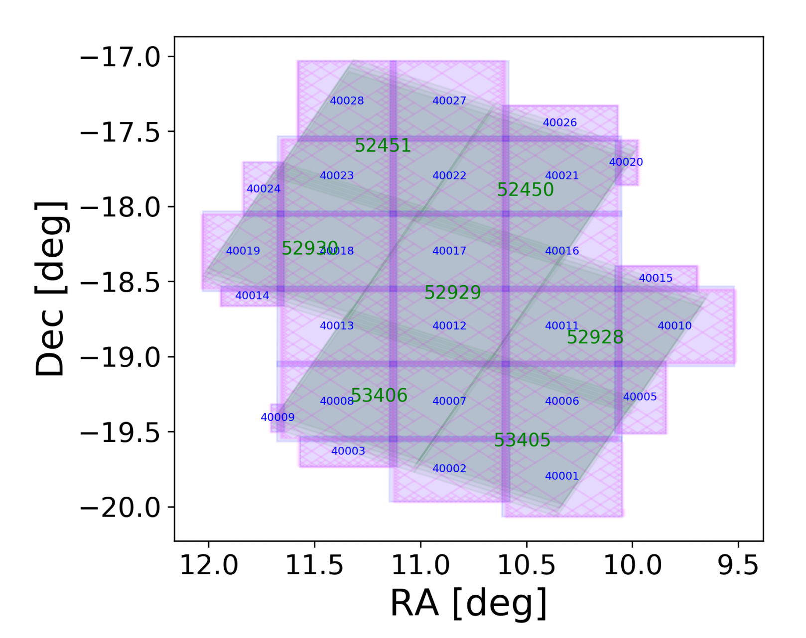

# [SC456 Paris](https://euclid.roe.ac.uk/projects/ec_sgs_challenges/wiki/2019-03-05_SC456_Meeting)

* Next meetings
    - Infra, June 3rd, Helsinki
    - SC, June 4th-7th, Helsinki
    - Infra+SC, September 17-20 TBD

## Coordination activities
* SIM best case 1 week late (11/03 prod start)
* Best case
    - 22-26/04 SHE, PHZ, SPE & SIR start running
    - 24/05 - PHZ catalog should be processed in all SDCs (52929 x 7 obs)
    - 15/09 Main objectives
        * 52929 & 1717 processed in all SDCs with all PFs
        * Large wide field (x38) processed with distribution strategy
    - 15/09 Secondary objectives
    - 15/10 - TK2 (Technical Keypoint 2) ([PHZ TK1 presentation](https://wiki.cosmos.esa.int/euclid/images/d/dc/08-TK1_PHZ_PF_V00.pdf))
    - End of 2019 - Secondary objectives complete & deep execution finished
    
## SIM
* TU common in all bands, and stars and galaxies cut to the same depth VIS < 26
    - [Flagship](https://www.euclid-ec.org/?page_id=4133)
* Real bright stars (pickles instead of besançon for SC3)
* [Bug #9661](https://euclid.roe.ac.uk/issues/9661): Possible wrong calibration of galaxy fluxes in VIS simulated images
    - Error in magnitude system for stars (AB instead of Vega)
    - Fixed, also for NIS
    - New production running
    
## NIR
> "Need to work on the integration of SEx++"

## [MER](https://euclid.roe.ac.uk/attachments/download/16589/2019-03-05_SC_meeting_MER_status.pdf)
* Field 52929
    - 28 tiles
    - 15 normal sizes
    - 13 smaller size
tr

## SHE
* [Feature #7662](https://euclid.roe.ac.uk/issues/7662): Need to define PHZ/SED table format

## CT
* [Machine Learning Working Group](https://euclid.roe.ac.uk/projects/sgssteassau/wiki/MLDL_WG)

## [Schedule](https://euclid.roe.ac.uk/attachments/download/16608/SC456_WrapUp.pdf)
Data needed: 1 FoV from SIM

| PF  | Data needed | CCB Deadline | Effort | Comments |
|-----|-------------|--------------|--------|----------|
| SIM | 15/03/19    | 01/04/19     | No     |          |
| VIS | 22/03/19    | 01/04/19     | No     |          |
| NIR | 22/03/19    | 01/04/19     | No     |          |
| EXT | 15/03/19 (K+D) 29/03/19 (A) | 01/04/19 | No | Based on delivery date announced |
| MER | 05/04/19    | 15/04/19     | 1 week | EXT + 3W |
| SIR | 26/04/19    | 26/04/19     | 1 week | MER + 3W |
| SHE | 10/05/19    | 10/05/19     | No     |          |
| **PHZ** | **10/05/19**    | **10/05/19**     | **No**     |          |
| SPE | 20/05/19    | 20/05/19     | 1 week | SIR + 3W |

For June (Helsinki CM)

* VIS, NIR, MER, DES and ST2 : working for the 7 FOVs in 7 SDCs
* SIR, SHE, PHZ working in 7 SDCs for the 2 FOVs
* SPE working in 3 SDCs for 1 FOVs
* KIDS and LSST working in primary SDCs
* SIM everywhere will be tested after

CCB: Configuration Control Board

# Infra
Monday Helsinki in parallel with Garage Day.